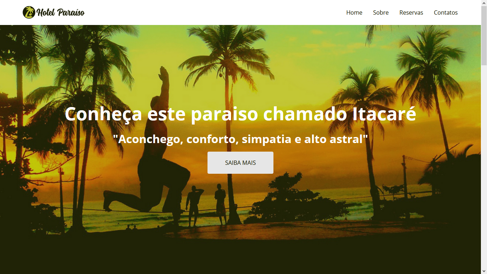
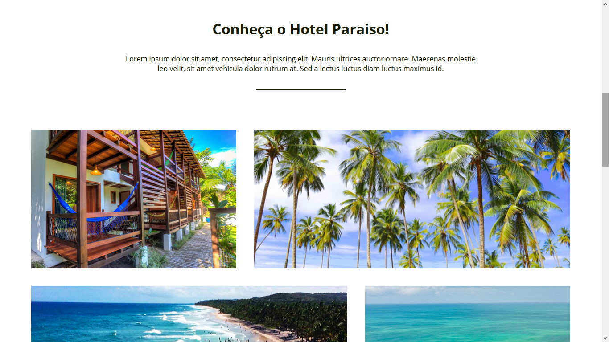
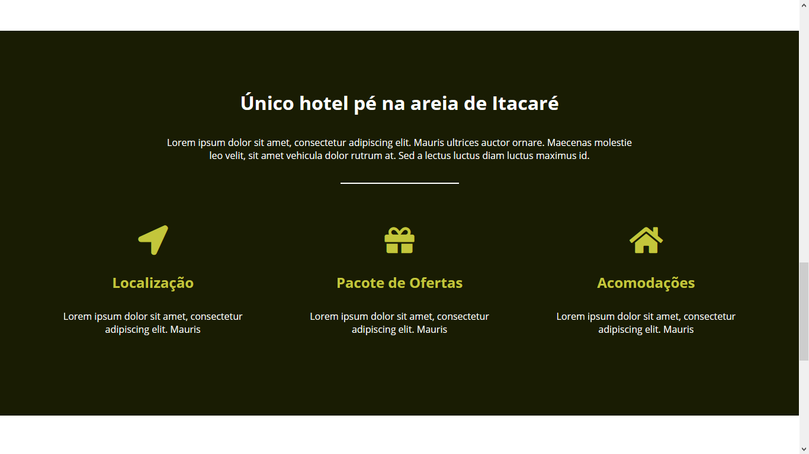
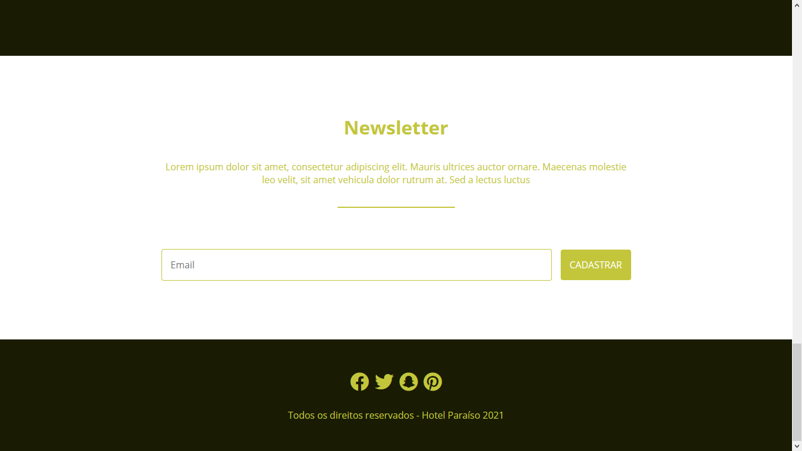

# HotelParaiso-flexbox
Project do learing e pratic flex-box design

## About the project

Responsive website using css flex-box, developed during the tutorial: <a href="https://www.youtube.com/playlist?list=PLwXQLZ3FdTVGjLmjwfRc0Q9TA5U-PCWp4">Curso de CSS Flexbox</a> of the channel <a href="https://www.youtube.com/c/NodeStudioTreinamentos" >Node Studios Treinamentos</a> 

<ul>
<li> access the page <a href="https://lucavini.github.io/HotelParaiso-flexbox/">here</a> </li></ul>

